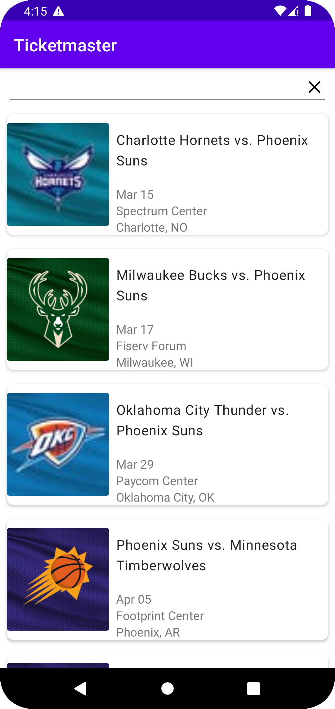
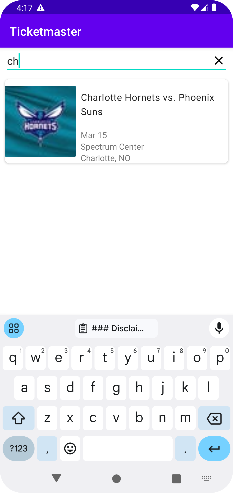

### Disclaimer

This fills out all the requirements in the Must have section. UI tests are not included due to issues on the setup of them

As part of the test it was followed a clean, modularized architecture, having the UI layer communication throughout the MVI approach

Unit tests are added in the `feature:events` module

Also added in this repository a simple continuous integration pipeline, in order to test and prevent PR merges to break production code

### Screenshots

Idle state
<table>
  <thead>
    <tr>
      <td>
        <b>Idle state</b>
      </td>
      <td>
        <b>Searching state</b>
      </td>
    </tr>
  </thead>
  <tbody>
  <tr>
    <td>
      
    </td>
    <td>
      
    </td>
  </tr>
  </tbody>
</table>

### Libraries used

- ViewBinding - For better UI control, no views not found exception
- Koin - Dependency Injection
- Room - Database
- Retrofit - API connection
- Kotlin coroutines - Asynchronous operations
- Flow - Reactive programming
- Github actions CI
  
### Improvements

As part of the improvements, it could be listed:
- Add some UI tests
- Pipeline:
  - Create base jobs on the pipeline, so we reuse the base steps of setting up java and gradle
  - Generate artifacts

### What could be done in a different way - (Not required in the test)

- Instead of loading the data from remote and then saving it into the database. I could have relied on the database as single source of truth and, implemented a network listener with a stream, so that whenever there's connection change from `NO_CONNECTION` to `CONNECTED` the data would be sync again and the screen updated.
- Could have used Regex for the search and/or search by any containing word with the text entered by the user
- Could have used Jetpack compose

